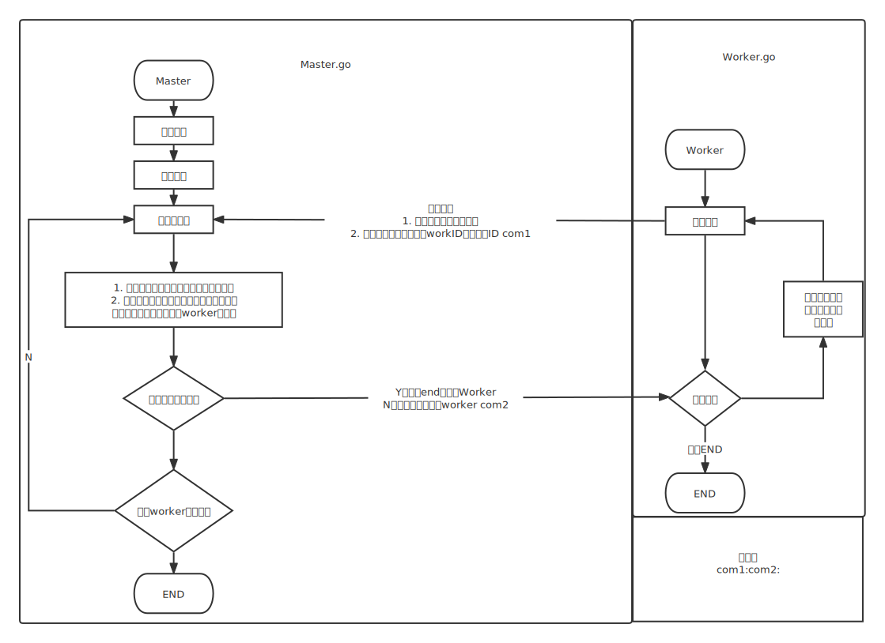

# MapReduce

master实质上是一个RPC Server

根据Hint的提示

1. 先让worker 发送 RPC 到 master 询问一个工作

2. master回复filename给worker，然后worker通过--plugin中加载的wc.so去调用map函数

# 问题
1. worker显示dialing:dial unix /var/tmp/824-mr-0: connect: connection refused
    这个原因是master比worker早退出导致的

    而master 比worker早退出是由于我再Done函数里面默认放回的是true，而Done函数内部对MapJobDone和ReduceJobDone没有初始化，导致直接放回true
    而mrmaster隔一段时间会检查master.Done()，放回true 就默认他退出了 shit